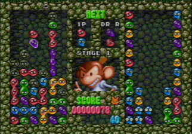

A program that plays Puyo Puyo:

...not in an emulator, it plays for real. Instead of eyes, it has a video capture card. Instead of hands it has an Arduino plugged into a controller slot.

The game is Puyo Puyo, a competitive tetris-like tile matching game. Planning combos is essential to playing the game well, so it's perfect to write an AI for. The version I use is called "Dr. Robotnik's Mean Bean Machine" on the Gamecube (in the "Sonic Mega Collection"). That's just the version I happen to have and test with.

Setup
=====

First of all, you'll need:

 * `python2.7`
 * `pyserial`
 * `numpy`
 * `OpenCV` with the `cv2` Python bindings

**TODO**

 * Arduino Setup: **TODO**
 * Video Setup: **TODO**

Usage
=====

`run.py` is the main script that runs all components in tandem. There are also
a bunch of scripts to manually test components. Use `-h` or `--help` to get
details on usage.

 * `run.py` - Plays the game. Recognizes game state through video, decides
        what move to make, and makes it.
 * `gc_send.py` - For testing Gamecube communication. Sends a command to the
        arduino controlling the Gamecube.
 * `simulate_ai.py` - For testing AIs. Reproduces the mechanics of the game and
        lets the AI make moves.
 * `simulate_board.py` - For testing the game mechanics. Allows the user to
        test the board mechanics by placing one piece at a time.
 * `recognize_board.py` - For testing the vision processing. Takes video input
        and shows the reconstructed game state.

Status
======

This is a work in progress, but it does run end-to-end. Here's the progress of
each major component:

 * Vision Processing - Determines game state from video input.
   * Status: Works decently well, but still has some color recognition bugs.
 * Artificial Intelligence - Decides where pieces should be placed based on the
        current game state.
   * Status: There are some simple AIs written, but there is a lot more work to
             do before they are competitive.
 * Game Control - Sends button presses to the game based on the output of the
        AI.
   * Status: Basic functionality finished.

Milestones:

 1. ~~Simple AI controlling the game~~
 1. AI that can beat the early opponents
 1. AI that can beat me (I'm not that good)
 1. AI that can beat the final boss, Dr. Robotnik
