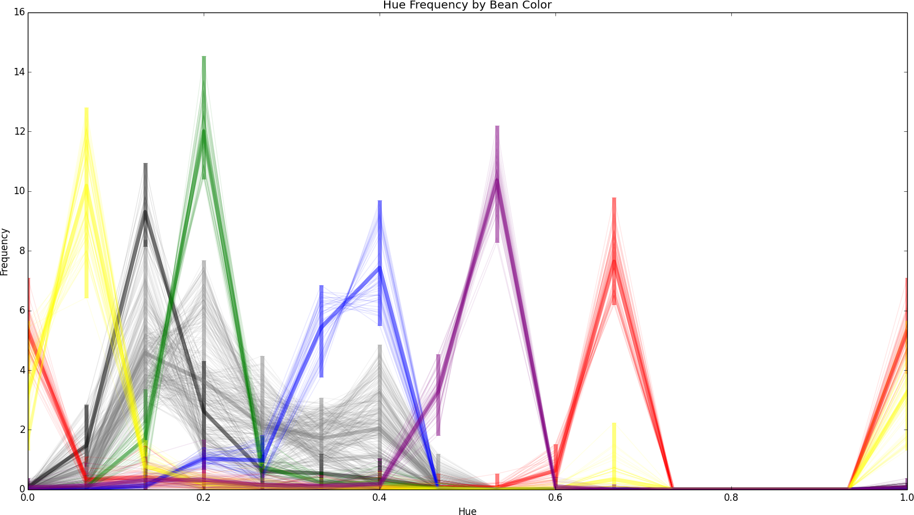

This folder contains scripts to train the vision system's beanfinder. The end
result is a hue histogram for each type of cell. The hue histogram is what the
vision system uses to determine what color bean a given cell is.

Here is the process:

 1. Gather sample images
 1. Crop cells from the image using `crop_cells.py`
 1. Manually classify each image into folders "background", "nuisance", "red",
    "green", "blue", "yellow" and "purple".
 1. Run `histograms.py`
   * This will output a graph showing the hue histogram for each sample, as
     well as the average hue for each color.
   * Printed out are the average hue histograms for each color. These
     histograms can be copied to `HUE_HISTOGRAMS` in `puyo/beanfinder.py` to
     set the color profile of each color bean.

The histogram output shows line for each sample in the color that the sample is classified as. There is also a thicker line for each color showing average, min and max hue. Background cells are grey, while nuisance are black.

